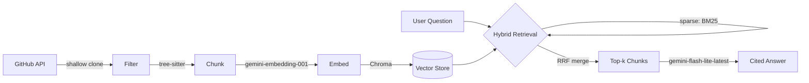

# Repo RAG

Ask natural-language questions about your own GitHub repositories and get answers grounded in the actual code — with inline citations pointing to real files and line numbers, not paraphrased guesses.

```
$ python cli.py "how does the order matching engine handle partial fills?"

The order matching engine handles partial fills by updating the order status and
tracking the quantity filled:

* Status Updates: if an order is not fully filled after matching, its status is
  set to StatusPartial (QuantHFT/services/matching-engine/internal/engine/orderbook.go:76-78)
* Quantity Tracking: executeTrade calculates trade quantity as the minimum of the
  remaining quantities of the buy and sell orders, then increments Filled for both
  (QuantHFT/services/matching-engine/internal/engine/orderbook.go:133-141)
...
```

Currently indexes 4 repositories (Gravitas, QuantHFT, GrowEasy, FeedFlow) at the function/method level — **487 chunks** total, retrieval measured at **72% (13/18) on a hand-written eval set**.

## Why this exists

Most "chat with your codebase" demos split files by character count and call it RAG. This project is an exploration of what it actually takes to do that well: AST-aware chunking, hybrid retrieval, grounded citations, incremental re-indexing, and a measured (not assumed) retrieval quality score — built entirely on free-tier infrastructure.

## Architecture



## Design decisions

**Chunking by function/method boundary, not character count** — each file is parsed into an AST via `tree-sitter`; the chunker walks the tree and extracts each function/method as its own chunk (recursing through classes so methods are captured individually, without ever treating a whole class as one blob). Files with no parseable functions (`.md`, unsupported languages, parse failures) fall back to a 50-line sliding window with 10-line overlap. This is the single decision with the most impact on retrieval quality — a naive split can bisect a function; this can't.

**Hybrid retrieval (dense + BM25), merged by rank not score** — dense vector search finds semantic matches ("how are orders matched" → matching engine code, even without the word "matched"); BM25 keyword search finds exact identifiers dense search blurs (`MatchOrder`, `crm_status`). Both run per query and merge via **Reciprocal Rank Fusion**, which combines by rank position rather than raw score — necessary because cosine similarity (~0–1) and BM25 scores (unbounded) live on incompatible scales that can't be averaged directly.

**Asymmetric embeddings** — chunks are embedded at index time with `task_type=RETRIEVAL_DOCUMENT`; questions are embedded at query time with `task_type=RETRIEVAL_QUERY`. Same model, different declared role — Gemini's embedding model is trained to place these two types of text closer together than a symmetric embedding would.

**Per-line-numbered context for generation** — retrieved chunks are annotated with their real source line number on every line before being handed to the model, and the system prompt forces inline citations. Without this, the model estimates line numbers by position within the chunk rather than citing the real ones — a subtle but real form of citation hallucination that showed up during development and was fixed by grounding every line explicitly.

**Incremental re-indexing at repo granularity** — `index_manifest.json` tracks each repo's last-indexed commit SHA. An unchanged repo is skipped entirely (a no-op run completes in ~7 seconds vs. several minutes for a full index); a changed repo has all of its existing chunks deleted and fully rebuilt from scratch. Granularity is per-repo rather than per-file — a deliberate scope tradeoff (some redundant re-embedding of unchanged files within a changed repo) in exchange for a much simpler, always-correct implementation with no risk of orphaned chunks left behind by deleted or renamed functions.

**Measured, not assumed, retrieval quality** — `eval.py` runs 18 hand-written questions with known-correct source files through the retriever and reports retrieval@5. This surfaced a genuine, reproducible finding: both `auth.py` files (FeedFlow and Gravitas) miss on "authentication" queries, because the code says `token`/`jwt`/`verify_user` rather than the literal word, while each repo's README has an `## Authentication` heading that wins on both semantic and keyword signals. Not a bug fixed by tuning — a documented, systematic vocabulary-mismatch limitation of hybrid retrieval.

**Everything runs on free-tier APIs** — no billing enabled anywhere. This shaped real implementation details: retry/backoff tuned differently for rate-limit errors (429) vs. other transient failures, resumable indexing so a rate limit mid-run doesn't lose progress, and generation/embedding model names verified directly against the API's model list rather than trusted from documentation (`gemini-2.0-flash` turned out to have zero free-tier quota on this project despite being a valid model name; `text-embedding-004` had been retired entirely).

## Project structure

```
repo_rag/
  github_source.py   list + shallow-clone repos via the GitHub API
  source_files.py     filter files (extension whitelist, dir blacklist, size cap)
  chunker.py           tree-sitter chunking + sliding-window fallback
  embedder.py          Gemini embeddings with retry/backoff
  store.py              Chroma persistence layer
  retriever.py          HybridRetriever: dense + BM25 + RRF
  generator.py           grounded generation, citations, conversational query rewriting
  manifest.py            commit-SHA tracking for incremental re-indexing

main.py           run the full ingest -> chunk -> embed -> store pipeline
cli.py               one-shot terminal Q&A: `python cli.py "question"`
chat_app.py          Streamlit conversational chat UI (multi-turn, with query rewriting)
eval.py               retrieval@5 scoring against a hand-written question set
query.py, test.py    ad hoc scripts used during development to sanity-check individual stages
```

## Setup

```bash
git clone https://github.com/addy-25/Repo-RAG.git
cd Repo-RAG
python3 -m venv venv
source venv/bin/activate
pip install -r requirements.txt
```

Copy `.env.example` to `.env` and fill in:

```
GITHUB_TOKEN=      # github.com/settings/tokens - fine-grained, read-only Contents + Metadata
GOOGLE_API_KEY=     # aistudio.google.com/apikey - free tier, no billing required
```

Set which repos to index in `main.py`:

```python
REPO_ALLOWLIST = {"Gravitas", "QuantHFT", "GrowEasy", "FeedFlow"}
```

## Usage

Build (or incrementally update) the index:

```bash
python main.py
```

Ask a one-shot question from the terminal:

```bash
python cli.py "how does the CSV importer handle duplicate emails?"
python cli.py "question" --k 10              # widen retrieved context
python cli.py "question" --no-show-sources    # answer only, no source list
```

Run the conversational chat UI:

```bash
streamlit run chat_app.py
```

Supports multi-turn follow-ups — a question like "what about market orders?" is rewritten against conversation history into a standalone query before retrieval, so it resolves correctly instead of retrieving on "market orders" in isolation.

Score retrieval quality:

```bash
python eval.py
```

## Known limitations

- Retrieval favors literal vocabulary overlap between the question and the source text — see the `auth.py` finding above. Embedding file/function names alongside code content would likely close this gap.
- Incremental re-indexing operates per-repo, not per-file — see Design Decisions.
- Free-tier API quotas cap indexing throughput; a full from-scratch index of the current 4 repos takes several minutes due to deliberate rate-limit pacing.
