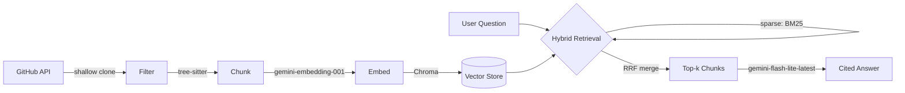

# Repo RAG

Ask natural-language questions about your own GitHub repositories and get answers grounded in the actual code — with inline citations pointing to real files and line numbers, not paraphrased guesses.

```
$ python cli.py "how does the order matching engine handle partial fills?"

The order matching engine handles partial fills by updating the order status and
tracking the quantity filled:

* Status Updates: if an order is not fully filled after matching, its status is
  set to StatusPartial (QuantHFT/services/matching-engine/internal/engine/orderbook.go:76-78)
* Quantity Tracking: executeTrade calculates trade quantity as the minimum of the
  remaining quantities of the buy and sell orders, then increments Filled for both
  (QuantHFT/services/matching-engine/internal/engine/orderbook.go:133-141)
...
```

Currently indexes 4 repositories (Gravitas, QuantHFT, GrowEasy, FeedFlow) at the function/method level — **487 chunks** total, retrieval measured at **72% (13/18) on a hand-written eval set**.

## Why this exists

Most "chat with your codebase" demos split files by character count and call it RAG. This project is an exploration of what it actually takes to do that well: AST-aware chunking, hybrid retrieval, grounded citations, incremental re-indexing, and a measured (not assumed) retrieval quality score — built entirely on free-tier infrastructure.

## Architecture



## Design decisions

Each choice below is a talking point in its own right; the one-line summary is the takeaway, the sentence after it is the reasoning.

### AST-based chunking
Chunks are split at function/method boundaries via `tree-sitter`, so a chunk is always a whole function — never bisected mid-body like a character-count split would be.
Files with no parseable functions (Markdown, unsupported languages) fall back to a 50-line sliding window. This is the single biggest lever on retrieval quality.

### Hybrid retrieval, merged by rank
Dense vector search catches meaning ("how are orders matched" → matching-engine code); BM25 keyword search catches exact identifiers dense search blurs (`MatchOrder`, `crm_status`).
Results merge via **Reciprocal Rank Fusion** — by rank position, not raw score, because cosine similarity (~0–1) and BM25 (unbounded) can't be averaged on the same scale.

### Asymmetric embeddings
Chunks are indexed as `RETRIEVAL_DOCUMENT`, questions embedded as `RETRIEVAL_QUERY`.
Same model, different declared role — trained to pull a question and its answer chunk closer than a symmetric embedding would.

### Line-numbered generation context
Every retrieved line is prefixed with its real source line number before the model sees it, and the prompt forces inline citations.
Without this, the model guesses line numbers by position within the chunk — a subtle citation hallucination that this grounds out entirely.

### Incremental re-indexing
`index_manifest.json` tracks each repo's last-indexed commit SHA: unchanged repos are skipped (~7s no-op run), changed repos are wiped and rebuilt.
Granularity is per-repo, not per-file — a deliberate simplicity/correctness tradeoff that guarantees no orphaned chunks from deleted or renamed functions.

### Measured retrieval quality
`eval.py` scores retrieval@5 over 18 known-answer questions instead of relying on vibes.
It surfaced a reproducible finding: "authentication" queries miss both `auth.py` files (whose code says `token`/`jwt`, not the literal word) while each README's `## Authentication` heading wins — a documented vocabulary-mismatch limitation, not a bug.

### Free-tier only
No billing enabled anywhere, which shaped real implementation details.
429-specific backoff, resumable indexing, and model names verified against the live API — `gemini-2.0-flash` had zero free-tier quota despite being valid, and `text-embedding-004` was retired entirely.

## Project structure

```
repo_rag/
  github_source.py   list + shallow-clone repos via the GitHub API
  source_files.py     filter files (extension whitelist, dir blacklist, size cap)
  chunker.py           tree-sitter chunking + sliding-window fallback
  embedder.py          Gemini embeddings with retry/backoff
  store.py              Chroma persistence layer
  retriever.py          HybridRetriever: dense + BM25 + RRF
  generator.py           grounded generation, citations, conversational query rewriting
  manifest.py            commit-SHA tracking for incremental re-indexing

main.py           run the full ingest -> chunk -> embed -> store pipeline
cli.py               one-shot terminal Q&A: `python cli.py "question"`
chat_app.py          Streamlit conversational chat UI (multi-turn, with query rewriting)
eval.py               retrieval@5 scoring against a hand-written question set
query.py, test.py    ad hoc scripts used during development to sanity-check individual stages
```

## Setup

```bash
git clone https://github.com/addy-25/Repo-RAG.git
cd Repo-RAG
python3 -m venv venv
source venv/bin/activate
pip install -r requirements.txt
```

Copy `.env.example` to `.env` and fill in:

```
GITHUB_TOKEN=      # github.com/settings/tokens - fine-grained, read-only Contents + Metadata
GOOGLE_API_KEY=     # aistudio.google.com/apikey - free tier, no billing required
```

Set which repos to index in `main.py`:

```python
REPO_ALLOWLIST = {"Gravitas", "QuantHFT", "GrowEasy", "FeedFlow"}
```

## Usage

Build (or incrementally update) the index:

```bash
python main.py
```

Ask a one-shot question from the terminal:

```bash
python cli.py "how does the CSV importer handle duplicate emails?"
python cli.py "question" --k 10              # widen retrieved context
python cli.py "question" --no-show-sources    # answer only, no source list
```

Run the conversational chat UI:

```bash
streamlit run chat_app.py
```

Supports multi-turn follow-ups — a question like "what about market orders?" is rewritten against conversation history into a standalone query before retrieval, so it resolves correctly instead of retrieving on "market orders" in isolation.

Score retrieval quality:

```bash
python eval.py
```

## Known limitations

- Retrieval favors literal vocabulary overlap between the question and the source text — see the `auth.py` finding above. Embedding file/function names alongside code content would likely close this gap.
- Incremental re-indexing operates per-repo, not per-file — see Design Decisions.
- Free-tier API quotas cap indexing throughput; a full from-scratch index of the current 4 repos takes several minutes due to deliberate rate-limit pacing.
